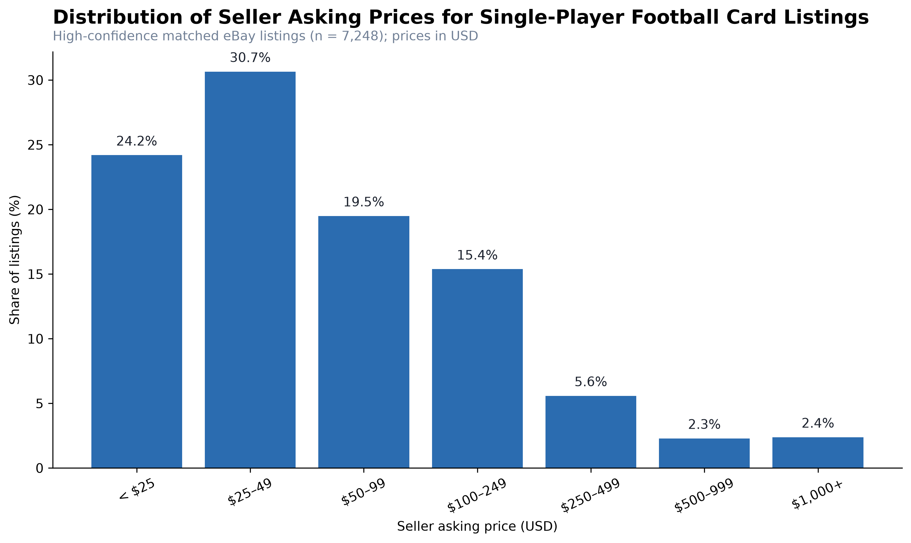
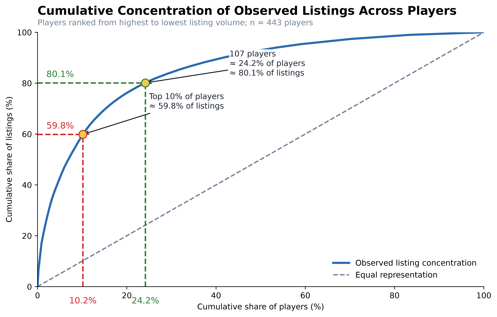

# eBay Soccer Card Market Analysis

## Project Background

Buying soccer cards on eBay can be confusing for **new collectors**.

The same player can have many different cards, and prices can vary by **brand, product line, card type, rarity, and market demand**. Without a clear way to compare them, it can be hard to know what a reasonable price looks like or which cards are worth exploring.

This project uses data to make the soccer card market easier to understand.

It focuses on two major brands, **Topps and Panini**, and looks at how their products are distributed and priced on eBay. It also connects card prices with player performance to explore how the market values different players.

## Objective

This project aims to help **new soccer card collectors make more informed buying decisions on eBay** by answering three simple questions:

1. What types of soccer cards are available on eBay?

    Understand the distribution of **Topps and Panini** products in the market.

2. How much do different card products usually cost?

    Compare **product lines and price ranges** across Topps and Panini.

3. Do card prices match player performance?

    Compare **on-field performance** with **player card values on eBay**.

> **Goal:** This project does not aim to predict future card prices.  
> Instead, it provides a **simple, data-driven learning guide** to help newcomers understand the soccer card market before buying.

## Dataset

This project uses three main datasets:

1. **eBay Market Data**  
   Historical soccer card market data collected from **eBay Marketplace Insights**.  
   The dataset includes card information, listing details, and market prices.  
    [View Metadata](metadata/metadata_eBay-Market-Data.md)

2. **Player Match Statistics**  
   Match-level player performance data collected from **FotMob**.  
   The dataset includes statistics such as minutes played, goals, assists, shots, passing, and other match performance metrics.  
   [View Metadata](LINK_TO_MATCH_STATS_METADATA)

3. **Player Profiles**  
   Player profile data collected from **FotMob**.  
   The dataset includes player information such as name, position, team, nationality, and other profile details.  
   [View Metadata](LINK_TO_PLAYER_PROFILE_METADATA)

## 

### Seller Asking-Price Market Distribution

  

  <b>Figure 1.</b> Distribution of seller asking prices for 7,248 single-player soccer card listings. The x-axis shows price ranges in USD, while the y-axis shows the percentage of listings in each range.

The graph shows that most soccer card listings are concentrated in the lower price ranges.

**Nearly 3 out of 4 listings (74.4%) are priced below $100**, and the largest group is the **$25–49 range**, which represents **30.7% of all listings**.

As prices increase, the number of listings drops quickly. Only **4.7% of listings are priced at $500 or more**, showing that very expensive cards make up only a small part of the market.

The difference between the **mean price of $187** and the **median price of $45** is also important. A few very expensive listings push the average much higher, so the average does not represent a typical card very well.

For this reason, the **median price** is more useful when trying to understand what a typical soccer card listing looks like.

> [!IMPORTANT]
> **Key Finding:** Most soccer cards in this dataset are priced below $100. For newcomers, the **median price and similar listings** are better reference points than the overall average because a small number of very expensive cards can make the market look more expensive than it really is.

## Player Market Distribution

The dataset contains **7,248 listings from 443 players**, but the listings are not evenly distributed across players.

Some players appear hundreds of times, while many players appear only a few times.

> Listing volume shows **market representation**, not buyer demand.  
> A player with more listings may simply have more cards available, more product releases, or more seller activity.

### How Concentrated Is the Market?

  

  <b>Figure 2.</b> Cumulative share of eBay listings across 443 players, ranked from the highest to lowest listing volume.

The graph shows that listings are highly concentrated among a relatively small group of players.

- The **top 10% of players account for about 59.8% of all listings**
- Around **24% of players account for about 80% of all listings**
- More than half of the players have **5 listings or fewer**

This means that the eBay sample is dominated by a smaller group of highly represented players, while many other players have limited market coverage.

> [!IMPORTANT]
> **Key Finding:** A large number of listings does not mean a player has stronger demand. It means there is **more market information available** for that player.

---

### Which Players Appear Most Often?

  

  <b>Figure 3.</b> Players with the highest number of observed listings in the eBay sample.

**Erling Haaland** has the largest listing volume with **489 listings**, or about **6.8% of the full dataset**.

He is followed by:

- **Julián Álvarez — 254 listings**
- **Lewis Miley — 253 listings**
- **Alejandro Garnacho — 245 listings**

The large differences between players show that some player markets have much more available data than others.

> [!IMPORTANT]
> **Key Finding for Newcomers:** Be more careful when comparing players with very different listing counts. A price based on many listings gives a stronger picture of the observed market than a price based on only a few cards.
