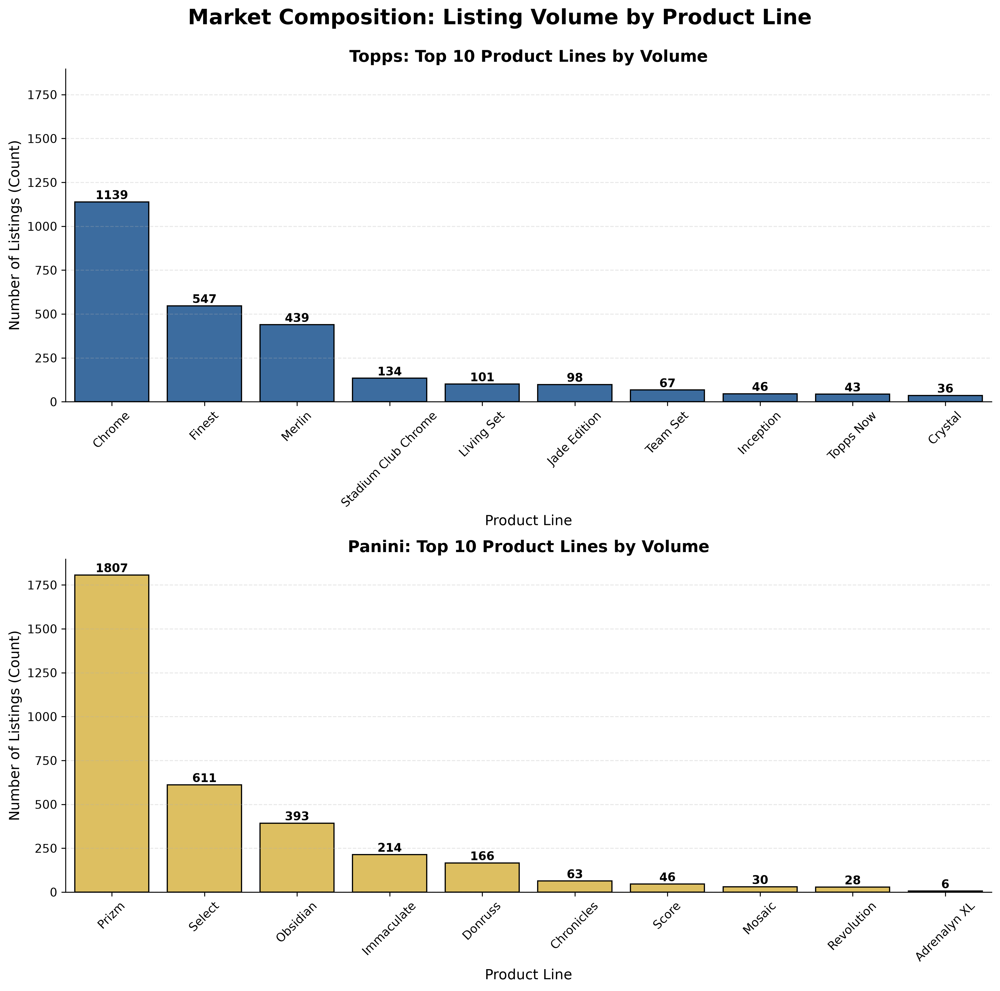
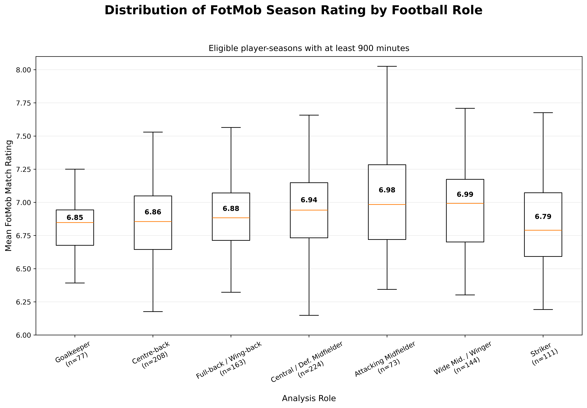
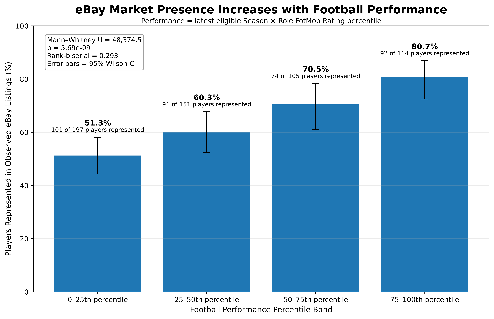
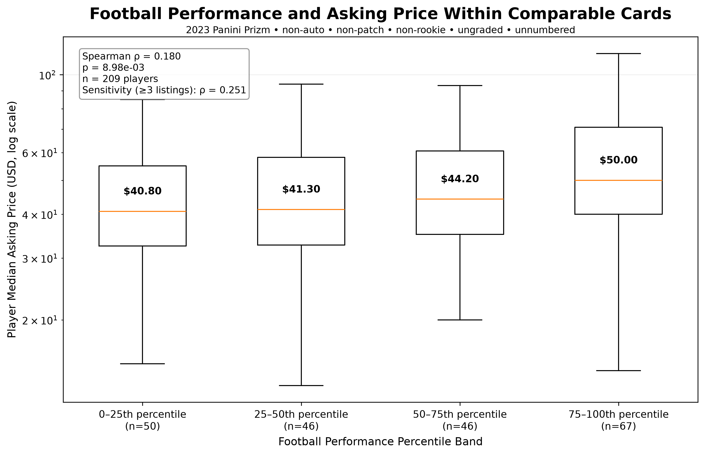
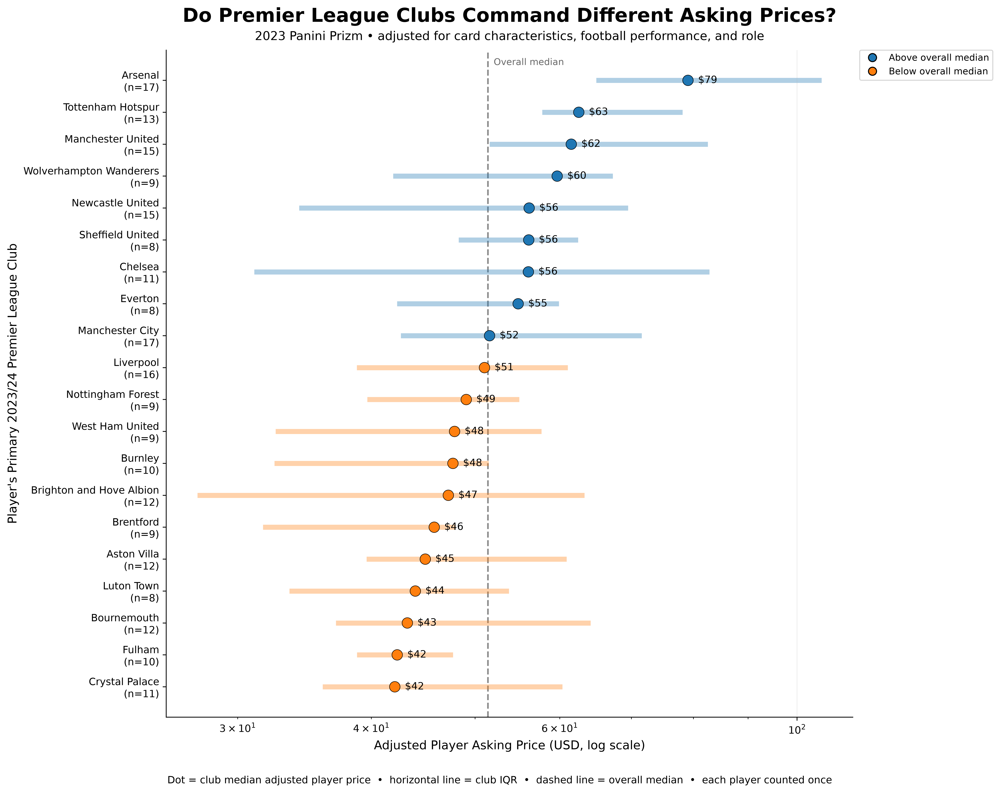

eBay Soccer Card Market Analysis

---

# Project Background

Buying soccer cards on eBay can be confusing for **new collectors**.

The same player can have many different cards, and prices can vary by **brand, product line, card type, rarity, and market demand**. Without a clear way to compare them, it can be hard to know what a reasonable price looks like or which cards are worth exploring.

This project uses data to make the soccer card market easier to understand.

It focuses on two major brands, **Topps and Panini**, and looks at how their products are distributed and priced on eBay. It also connects card prices with player performance to explore how the market values different players.

# Objective

This project aims to help **new soccer card collectors make more informed buying decisions on eBay** by answering three simple questions:

1. What types of soccer cards are available on eBay?

    Understand the distribution of **Topps and Panini** products in the market.

2. How much do different card products usually cost?

    Compare **product lines and price ranges** across Topps and Panini.

3. Do card prices match player performance?

    Compare **on-field performance** with **player card values on eBay**.

> **Goal:** This project does not aim to predict future card prices.  
> Instead, it provides a **simple, data-driven learning guide** to help newcomers understand the soccer card market before buying.

Dataset

This project uses three main datasets:

1. **eBay Market Data**  
   Historical soccer card market data collected from **eBay Marketplace Insights**.  
   The dataset includes card information, listing details, and market prices.  
    [View Metadata](https://github.com/KanitAon/ebay-soccer-card-market-analysis/blob/main/metadata/metadata_eBay-Market.md)

2. **Player Match Statistics**  
   Match-level player performance data collected from **FotMob**.  
   The dataset includes statistics such as minutes played, goals, assists, shots, passing, and other match performance metrics.  
   [View Metadata](https://github.com/KanitAon/ebay-soccer-card-market-analysis/blob/main/metadata/metadata_Player_Match_Statistics.md)

3. **Player Profiles**  
   Player profile data collected from **FotMob**.  
   The dataset includes player information such as name, position, team, nationality, and other profile details.  
   [View Metadata](https://github.com/KanitAon/ebay-soccer-card-market-analysis/blob/main/metadata/metadata_Player_Profiles.md)

---

# Market Distribution Overview

To understand what the eBay soccer card market looks like.

This section looks at the market from four views:

- **Seller Asking-Price Market Distribution** — Understand the typical price range of soccer card listings and how prices are distributed.
- **Player Market Distribution** — See whether listings are spread across many players or concentrated among a smaller group.
- **Brand and Product Line Distribution** — Compare how listings are distributed across **Topps, Panini, and their major product lines**.

Together, these views show **where most listings are found, which players have the most market coverage, and which brands and products are most visible on eBay**.

## Seller Asking-Price Market Distribution

  

*Figure 1: Distribution of seller selling prices for 7,248 single-player soccer card listings. The x-axis shows price ranges in USD, while the y-axis shows the percentage of listings in each range.*

The graph shows that most soccer card listings are concentrated in the lower price ranges.

**Nearly 3 out of 4 listings (74.4%) are priced below $100**, and the largest group is the **$25–49 range**, which represents **30.7% of all listings**.

As prices increase, the number of listings drops quickly. Only **4.7% of listings are priced at $500 or more**, showing that very expensive cards make up only a small part of the market.

The difference between the **mean price of $187** and the **median price of $45** is also important. A few very expensive listings push the average much higher, so the average does not represent a typical card very well.

For this reason, the **median price** is more useful when trying to understand what a typical soccer card listing looks like.

> [!IMPORTANT]
> **Key Finding:** Most soccer cards in this dataset are priced below $100. For newcomers, the **median price and similar listings** are better reference points than the overall average because a small number of very expensive cards can make the market look more expensive than it really is.

## Player Market Distribution

The dataset contains **7,248 listings from 443 players**, but the listings are not evenly distributed across players.

Some players appear hundreds of times, while many players appear only a few times.

> Listing volume shows **market representation**, not buyer demand.  
> A player with more listings may simply have more cards available, more product releases, or more seller activity.

### How Concentrated Is the Market

  

  *Figure 2: Cumulative share of eBay listings across 443 players, ranked from the highest to lowest listing volume.*

The graph shows that listings are highly concentrated among a relatively small group of players.

- The **top 10% of players account for about 59.8% of all listings**
- Around **24% of players account for about 80% of all listings**
- More than half of the players have **5 listings or fewer**

This means that the eBay sample is dominated by a smaller group of highly represented players, while many other players have limited market coverage.

> [!IMPORTANT]
> **Key Finding:** A large number of listings does not mean a player has stronger demand. It means there is **more market information available** for that player.

### Which Players Appear Most Often

  

  <b>Figure 3.</b> Players with the highest number of observed listings in the eBay sample.

**Erling Haaland** has the largest listing volume with **489 listings**, or about **6.8% of the full dataset**.

He is followed by:

- **Julián Álvarez — 254 listings**
- **Lewis Miley — 253 listings**
- **Alejandro Garnacho — 245 listings**

The large differences between players show that some player markets have much more available data than others.

> [!IMPORTANT]
> **Key Finding:** Be more careful when comparing players with very different listing counts. A price based on many listings gives a stronger picture of the observed market than a price based on only a few cards.

## Brand and Product Line Market Overview

The next step is to understand how the market is divided between **Topps and Panini**, and which product lines appear most often.

  

  <b>Figure 4.</b> Top product lines by observed listing volume for Topps and Panini. Both charts use the same scale to make the brands easier to compare.

Among the top 10 product lines shown in Figure 4:

Panini therefore represents about **56%** of the listings shown, compared with about **44% for Topps**.
This suggests that **Panini has a larger listing presence** in the observed sample.

For **Topps**, the market is mainly concentrated in:

- **Chrome — 1,139 listings**
- **Finest — 547 listings**
- **Merlin — 439 listings**

Chrome is clearly the most common Topps product line in the sample.

For **Panini**, the main product lines are:

- **Prizm — 1,807 listings**
- **Select — 611 listings**
- **Obsidian — 393 listings**

Prizm dominates Panini's listing volume and is also the most frequently observed product line across both brands.

> [!IMPORTANT]
> **Key Finding:** Panini has more listings overall in the product lines shown, while **Prizm and Chrome are the main entry points** for understanding each brand's market.

---

# What Affects Soccer Card Selling Prices

After understanding the overall eBay market, the next step is to explore **why some cards are priced higher than others**.

A card's selling price can be influenced by many factors beyond the player alone. This section looks at several important card characteristics:

- **Autograph & Patch** — Do special card features lead to higher selling prices?
- **Grading** — Are professionally graded cards priced higher than ungraded cards?
- **Rookie Status** — Does being a rookie card increase the selling price?
- **Product Tier** — How do card prices differ across Core, Mid, and Luxury products?

The goal is to understand **which card characteristics are associated with higher selling prices** and which factors may not matter as much as newcomers might expect.

> **For Newcomers:** A card is not expensive because of only one feature. The best comparison is usually with cards that have a similar **player, product line, grading status, rarity, and card type**.

## Card Features Affect selling price

### **Do special card features make cards more expensive?**

This analysis compares four card types:

- No Autograph / Patch
- Autograph Only
- Patch Only
- Autograph + Patch

  

  <b>Figure 5.</b> Average selling price by card type. The labels also show the number of observed listings in each group.

The graph shows that cards with both an **autograph and patch** have the highest average selling price at about **$271**, followed by **autograph-only cards at $236**.

Standard cards without an autograph or patch average about **$175**, while **patch-only cards average $146**.

However, average prices can be affected by a small number of very expensive listings. The median prices are much closer:

| Card Type | Listings | Average Price | Median Price |
||:|:|:|
| No Autograph / Patch | 5,784 | $174.75 | $44.99 |
| Autograph Only | 1,125 | $235.87 | $48.00 |
| Patch Only | 90 | $145.88 | $44.00 |
| Autograph + Patch | 249 | $271.11 | $64.99 |

The statistical results support an important point.

The difference in **average prices** is not statistically significant using Welch's ANOVA (`p = 0.106`), partly because prices vary widely and include extreme values.

However, the overall **price distributions are significantly different** using the Kruskal–Wallis test (`p < 0.001`).

The strongest difference appears in **Autograph + Patch cards**, which are significantly different from the other card groups in the pairwise comparisons.

> [!IMPORTANT]
> **Key Finding:** Cards with both an **autograph and patch** show the strongest price premium in this dataset. However, **special features do not always mean a higher price**. For example, **Patch Only** cards have a median price of about **$44**, which is very close to standard cards without an autograph or patch.

### **Does Brand Matter for the Same Card Type?**

After looking at autograph and patch features, the next question is:

> **For the same card type, do Panini and Topps have different selling prices?**

  

  <b>Figure 6.</b> Average selling prices for Panini and Topps across four card types: standard cards, autograph cards, patch cards, and autograph + patch cards.

The graph shows that the difference between **Panini and Topps depends on the card type**.

The largest gap appears in cards with **no autograph or patch**. Panini averages about **$263**, compared with only **$72 for Topps**. This is also the only category where the difference in average price is statistically significant (`p < 0.001`).

For cards with special features, the two brands are much closer:

- **Autograph Only:** Panini $237 vs. Topps $235
- **Patch Only:** Panini $168 vs. Topps $128
- **Autograph + Patch:** Panini $279 vs. Topps $249

The average-price differences in these three groups are **not statistically significant**.

This suggests that once a card includes features such as an **autograph or patch**, the feature itself may become more important to selling price than the brand alone.

Because card prices are highly skewed, these averages should still be read together with median prices and comparable listings.

> [!IMPORTANT]
> **Key Finding:** Brand does not affect every card type in the same way. The strongest Panini–Topps price gap appears among cards with **no autograph or patch**, while autograph and patch cards have much closer average prices. For newcomers, this means **do not assume one brand is always more expensive — compare the same card type across brands before buying**.

## Grading Affect selling price

Before comparing prices, it is useful to understand what **card grading** means.

Professional grading is when a card is sent to a third-party grading company to evaluate its **condition and authenticity**. The card is usually given a numerical grade and sealed in a protective holder.

For collectors, grading can make a card easier to compare because the condition has been reviewed by an independent company. Higher grades, especially for cards in strong condition, may also receive higher selling prices.

However, a graded card is not automatically more valuable. Price can still depend on the **player, card rarity, product line, grade score, grading company, and collector demand**.

To better understand the effect of grading, this analysis compares graded and ungraded cards only within the **same player and same box set**.

  

  <b>Figure 7.</b> Average selling price of graded and ungraded cards within 411 matched Player × Box Set groups.

The graph shows a clear difference between graded and ungraded cards.

- **Ungraded cards:** average selling price of **$121.30**
- **Graded cards:** average selling price of **$423.02**

On average, graded cards are priced about **249% higher** than ungraded cards within the same player and box set groups.

The difference is also statistically significant using a paired t-test:

**t = 4.54, p < 0.001**

This means the observed price difference is unlikely to be explained by random variation alone in this matched sample.

However, grading itself is not the only possible reason for the higher price. Graded cards may also differ in **card quality, rarity, grade score, or collector interest**.

> [!IMPORTANT]
> **Key Finding:** Graded cards have a much higher average selling price than ungraded cards in the matched sample. For newcomers, grading can be an important price factor, but always check the **grade, grading company, card rarity, and comparable listings** before assuming that every graded card is worth more.check the **grade, grading company, card rarity, and comparable listings** before assuming that every graded card is worth more.

## Rookie Status Affect Selling Price

A **rookie card** is a card connected to a player's early professional career or first major card releases. Rookie cards often receive special attention from collectors because they represent an early stage of a player's career.

However, a card labeled as a rookie is **not automatically more expensive**. Price can also depend on the player, product line, rarity, autograph, grading, and overall collector interest.

To make the comparison fairer, rookie and non-rookie cards were compared only within the **same player and same box set**.

  

  <b>Figure 8.</b> Average selling price of rookie and non-rookie cards within 154 matched Player × Box Set groups.

Interestingly, the graph shows that **non-rookie cards have a higher average selling price** in this sample:

- **Non-Rookie:** $262.19
- **Rookie:** $170.48

However, the difference is **not statistically significant**.

The paired t-test gives:

**t = -0.89, p = 0.374**

A Wilcoxon signed-rank test gives a similar result:

**p = 0.195**

Since both p-values are above **0.05**, there is not enough evidence to conclude that rookie and non-rookie cards have different selling prices after matching the same player and box set.

> [!IMPORTANT]
> **Key Finding:** A **rookie label does not automatically mean a higher selling price**. In this matched sample, rookie cards are actually priced lower on average, but the difference is not statistically significant. For newcomers, rookie status should be considered together with **rarity, product line, autograph, grading, and comparable listings** rather than used as a price signal by itself.

## How Product Tier Relates to Card selling price

Before comparing individual card prices, it is useful to understand the **price of the box they come from**.

A higher-priced box usually represents a more premium product, but this does **not** mean every card inside the box will be expensive.

The box price is the **cost of entering the product**, while the card selling price shows how individual cards from that product are priced on eBay.

| Tier | Panini | Approx. Box Price | Topps | Approx. Box Price |
|||:||:|
| **Core** | Prizm | ~$270 | Chrome | ~$228 |
| **Mid** | Select | ~$300–320 | Merlin | ~$261 |
| **Luxury** | Immaculate | Higher-end | Dynasty | ~$1,782 |

> **Important:** Box prices and individual card selling prices should not be compared as a direct return on investment. A box contains multiple cards, while eBay listings often represent selected cards with different players, rarity, grading, autographs, and serial numbers.

## Average selling price by Product Tier

  

  <b>Figure 9.</b> Average selling price of individual cards from comparable Panini and Topps product tiers.

### Core: Prizm vs Chrome

At the Core tier, the box prices are relatively close:

- **Prizm:** about $270 per box
- **Chrome:** about $228 per box

The individual cards show a similar direction:

- **Prizm average:** $186
- **Chrome average:** $140

Prizm cards have a higher average selling price, but the difference in the means is **not statistically significant** (`p = 0.413`).

The median prices are:

- **Prizm:** $56.03
- **Chrome:** $29.58

This suggests that a typical Prizm listing is also priced higher, even though large price variation makes the difference in average prices statistically unclear.

### Mid: Select vs Merlin

The box prices are again relatively close:

- **Select:** about $300–320
- **Merlin:** about $261

However, the individual card market looks very different.

- **Select average:** $523
- **Merlin average:** $121

Select has an average selling price more than **4 times higher** than Merlin.

This is the strongest comparison in the analysis, and the difference in average prices is **statistically significant** (`p = 0.0005`).

However, the medians are much lower:

- **Select:** $90
- **Merlin:** $29.99

This shows that a small number of very expensive Select cards push the average much higher.

> The average tells us about the overall price level, while the median gives a better picture of a typical listing.

### Luxury: Immaculate vs Dynasty

The Luxury tier looks very different.

- **Immaculate average:** $259
- **Dynasty average:** $1,875

Dynasty appears dramatically more expensive, which is also consistent with its much higher box price.

However, there are only **2 Dynasty listings** in the dataset, compared with **214 Immaculate listings**.

Because of this very small sample, the Dynasty average should **not be treated as representative of the full market**.

> [!IMPORTANT]
> **Key Finding:** A more expensive box does not automatically mean every card from that product will have a higher selling price. The relationship depends heavily on the cards that appear in the market. In this dataset, the clearest difference appears in the **Mid tier**, where Select has a much higher average selling price than Merlin. For newcomers, use **box price to understand the product tier**, then compare **median prices, average prices, and similar individual cards** before buying.

---

# 🤔How Relation Between Player Performance and Card Sell Price 

The FotMob dataset is recorded at the match level:

> [!NOTE]
> **1 row = 1 player appearance in 1 Premier League match**

For each appearance, FotMob provides a **match rating** that summarizes the player's overall contribution.

Instead of focusing only on goals, assists, tackles, or saves, this project uses the **FotMob Rating** as the main performance measure.

This is useful because different positions have different jobs. A striker, defender, midfielder, and goalkeeper should not be judged using exactly the same individual statistics.

The goal of this section is therefore to build a **fair and independent measure of player performance** before comparing it with the eBay card market.

## From Match Ratings to Season Performance

One good match does not tell us how good a player was across an entire season.

A player may have one unusually strong game, while another player may perform consistently over many matches.

For this reason, match ratings are combined into a **season-level rating** for each player.

The analysis uses the average FotMob Rating across the player's rated appearances:

$$
\text{Season Rating}_{i,s} = \frac{1}{N_{i,s}} \sum_{m=1}^{N_{i,s}} \text{Rating}_{i,s,m}
$$

where:

- $N_{i,s}$ = number of rated match appearances for player $i$ during season $s$
- $\text{Rating}_{i,s,m}$ = FotMob rating received by player $i$ in match $m$

The unit of analysis therefore becomes:

> [!NOTE]
> **1 observation = 1 player in 1 Premier League season**

Across the three seasons from **2023/24 to 2025/26**, the dataset contains:

- **34,443 player-match observations**
- **1,669 player-season observations**

This gives us a more stable view of player performance than using individual matches.

> [!IMPORTANT]
> **Key Finding:** Player performance should be measured across a season, not from one match. Using season-level ratings reduces the impact of unusually good or bad individual games.

## Defining an Eligible Player

Not every player-season contains enough playing time to make a reliable comparison.

For example, a player who plays only 100 minutes may receive a very high rating from only a few appearances. That rating is based on much less evidence than the rating of a player who plays most of the season.

To reduce this small-sample problem, the main analysis requires:

$$
\text{Season Minutes} \geq 900
$$

Since a full match is about 90 minutes, this is roughly equal to:

**10 full matches**

After applying this rule:

**1,669 player-seasons → 1,000 eligible player-seasons**

These **1,000 player-seasons** form the main performance dataset.

> [!IMPORTANT]
> **Key Finding:** The 900-minute rule helps make performance comparisons more reliable. Players with very limited playing time are removed so that a small number of matches does not have too much influence.

## Keeping Performance Independent from the Card Market

An important part of this project is keeping **football performance separate from card-market information**.

The eligibility rules use only football data.

They do not use:

- eBay selling prices
- Listing volume
- Card rarity
- Grading
- Rookie status
- Autographs
- Other card characteristics

The analysis follows this order:

**Football Performance → Eligible Players → Card Market Comparison**

This is important because we want to measure player performance first and only then ask how the card market values those players.

This connects directly to the main idea of the project:

> **Does the soccer card market reflect on-field performance, or do other factors create differences between performance and market value?**

> [!IMPORTANT]
> **Key Finding:** Football performance is measured independently from the card market. This helps avoid using card prices to influence how player performance is defined.

## Assigning Players to Analysis Roles

Different football positions have very different responsibilities.

A striker should not be directly compared with a goalkeeper, and a center-back should not be judged in exactly the same way as an attacking midfielder.

To make comparisons fairer, eligible player-seasons are grouped into seven roles:

| FotMob Position | Analysis Role |
|||
| Keeper | Goalkeeper |
| Center Back | Centre-back |
| Left Back, Right Back, Wing-Back | Full-back / Wing-back |
| Central Midfielder, Defensive Midfielder | Central / Defensive Midfielder |
| Attacking Midfielder | Attacking Midfielder |
| Left Midfielder, Right Midfielder, Winger | Wide Midfielder / Winger |
| Striker | Striker |

This creates seven comparison groups:

1. **Goalkeeper**
2. **Centre-back**
3. **Full-back / Wing-back**
4. **Central / Defensive Midfielder**
5. **Attacking Midfielder**
6. **Wide Midfielder / Winger**
7. **Striker**

Each player is compared with players who have similar responsibilities in the **same season**.

The comparison group is therefore:

**Season × Analysis Role**

For example:

> A striker in 2024/25 is compared with other eligible strikers from 2024/25.

Across three seasons and seven roles, the analysis creates **21 peer groups**.

> [!IMPORTANT]
> **Key Finding:** Player performance is evaluated against players with similar roles in the same season. This creates a fairer comparison than ranking every Premier League player together.

## Do FotMob Ratings Behave Similarly Across Football Roles?

Before creating performance rankings, we first need to know whether FotMob Ratings behave the same way across different positions.

*Figure 10. Distribution of season-level FotMob Ratings across the seven analysis roles. Only player-seasons with at least 900 minutes are included.*

### How to Read the Graph

Each box represents the season ratings for one football role.

- The line inside the box shows the **median rating**
- The box shows the middle 50% of players
- The whiskers show the wider range of ratings
- `n` shows the number of eligible player-seasons

The graph shows that the rating distributions overlap, but they are **not exactly the same across roles**.

For example:

- **Wide Midfielders / Wingers:** median rating ≈ **6.99**
- **Attacking Midfielders:** ≈ **6.98**
- **Goalkeepers:** ≈ **6.85**
- **Strikers:** ≈ **6.79**

This means the same raw rating can represent different performance levels depending on the player's role.

For example, a **7.0 rating** may be well above average for a striker but much closer to average for an attacking midfielder.

Therefore:

> **Same Raw Rating ≠ Same Relative Performance**

To solve this problem, each player is ranked within their:

**Season × Role peer group**

The analysis then calculates:

- **Season × Role Rank**
- **Season × Role Percentile**

> [!IMPORTANT]
> **Key Finding:** Raw FotMob Ratings should not be compared across every player directly. A player's performance is better understood by comparing them with players who have similar responsibilities in the same season.

The project therefore asks:

> **How well did this player perform compared with players in the same role and season?**

## Are Stronger Football Performers More Likely to Appear on eBay?

Now that we have a fair performance measure, we can begin connecting football performance with the card market.

The first question is:

> **Are better-performing players more likely to appear in the observed eBay listings?**

*Figure 11. Percentage of eligible players represented in at least one observed eBay listing, grouped by their latest eligible Season × Role performance percentile.*

### How to Read the Graph

Players are divided into four performance groups:

| Performance Band | Players Represented | eBay Presence |
||:|:|
| 0–25th percentile | 101 of 197 | **51.3%** |
| 25–50th percentile | 91 of 151 | **60.3%** |
| 50–75th percentile | 74 of 105 | **70.5%** |
| 75–100th percentile | 92 of 114 | **80.7%** |

A clear pattern appears.

As player performance increases, **eBay market presence also increases**.

Only **51.3%** of players in the lowest performance group appear on eBay, compared with **80.7%** of players in the highest group.

That is a difference of **29.4 percentage points**.

The statistical test also finds a clear difference:

**Mann–Whitney U test: p = 5.69 × 10⁻⁹**

The effect size is:

**Rank-biserial correlation = 0.293**

This shows a positive relationship, but it is not perfect.

Even among the lowest-performing group, more than half of the players still appear on eBay. At the same time, some high-performing players do not appear.

> [!IMPORTANT]
> **Key Finding:** Better-performing players are more likely to appear in the observed eBay market. eBay presence rises from **51.3%** in the lowest performance group to **80.7%** in the highest group. However, performance alone does not determine market visibility.

This leads to a more important question:

> **If we compare similar cards, do better-performing players actually have higher selling prices?**

## Within Comparable Cards, Does Player Performance Relate to selling price?

Simply comparing all cards would not be fair.

A graded autograph card may naturally cost more than a standard ungraded card, regardless of the player's performance.

To reduce these differences, this analysis looks at one relatively similar group of cards:

- **Brand:** Panini
- **Product Line:** Prizm
- **Card Year:** 2023
- **Autograph:** No
- **Patch:** No
- **Rookie:** No
- **Graded:** No
- **Serial-numbered:** No

This produces:

**578 listings from 209 players**

For each player, the **median selling price** is used as the market value.

*Figure 12. Player-level median selling prices across performance groups within comparable 2023 Panini Prizm cards.*

### How to Read the Graph

Players are again divided into four performance groups.

| Performance Band | Players | Median selling price |
||:|:|
| 0–25th percentile | 50 | **$40.80** |
| 25–50th percentile | 46 | **$41.30** |
| 50–75th percentile | 46 | **$44.20** |
| 75–100th percentile | 67 | **$50.00** |

The median selling price increases gradually with player performance.

The highest-performing group has a median price of **$50**, compared with **$40.80** for the lowest group.

That is about **22.5% higher**.

However, the distributions still overlap heavily.

Some lower-performing players have expensive cards, while some high-performing players have relatively inexpensive cards.

The Spearman correlation confirms this:

**ρ = 0.180, p = 0.00898**

The relationship is statistically significant, but **weak**.

When the analysis is limited to players with at least three comparable listings:

**ρ = 0.251, p = 0.0284**

The relationship remains positive.

> [!IMPORTANT]
> **Key Finding:** When major card characteristics are kept similar, better football performance is associated with higher selling prices — but the relationship is weak. Median price rises from **$40.80** in the lowest performance group to **$50.00** in the highest group.

This is an important result for the project's *Moneyball* idea:

> **Performance matters, but it does not explain most of the differences in card prices.**

This means we need to look at other factors that may influence the market.

One possible factor is the player's **club**.

## After Controlling for Performance and Card Characteristics, Does Club Still Relate to selling price?

Players from different clubs may receive different levels of attention from collectors.

However, simply comparing raw club prices would not be fair.

One club may contain more star players, more rookie cards, or more rare cards than another.

This analysis therefore controls for:

- Rookie status
- Serial-numbered status
- Serial-number scarcity
- Football-performance percentile
- Football role

Each player is then represented once using their adjusted selling price.

*Figure 13. Adjusted player asking-price distributions across Premier League clubs after accounting for observable card characteristics, football performance, and football role.*

### How to Read the Graph

For each club:

- The **dot** shows the median adjusted player selling price
- The horizontal line shows the middle 50% of player prices
- `n` shows the number of players
- The dashed line shows the overall market median

Even after adjustment, differences remain between clubs.

The highest median adjusted prices include:

- **Arsenal:** about **$79**
- **Tottenham Hotspur:** about **$63**
- **Manchester United:** about **$62**

At the lower end:

- **Fulham:** about **$42**
- **Crystal Palace:** about **$42**

There is still substantial overlap between clubs, so club does not determine the price of every individual player.

However, adding club to the pricing model increases explanatory power by:

**ΔR² = 0.081**

or about **8.1 percentage points**.

The joint statistical test gives:

**p = 1.49 × 10⁻⁶**

This provides strong evidence that club still contains market information after accounting for the observed card and football characteristics.

> [!IMPORTANT]
> **Key Finding:** Club remains associated with card selling prices even after accounting for card characteristics, football performance, and football role. Adding club improves the model's explanatory power by about **8.1 percentage points**.

This suggests an important lesson:

> **The soccer card market values more than football performance alone.**

Player reputation, club visibility, popularity, collector interest, and other market factors may also influence how cards are priced.

## Overall Player Performance Insight

The analysis tells a clear story:

**Better Performance**
→ **Higher chance of appearing on eBay**
→ **Slightly higher prices for comparable cards**

But the relationship is not strong enough to explain the full card market.

> [!IMPORTANT]
> **Overall Key Finding:** On-field performance matters, but it is only one part of soccer card value. Two players with similar football performance can still have very different card prices because the market also reflects **club, popularity, card characteristics, rarity, and collector interest**.

This difference between **football performance** and **card-market valuation** is where the project's *Moneyball* idea becomes most useful:

> **Market perception and measurable performance do not always agree.**
