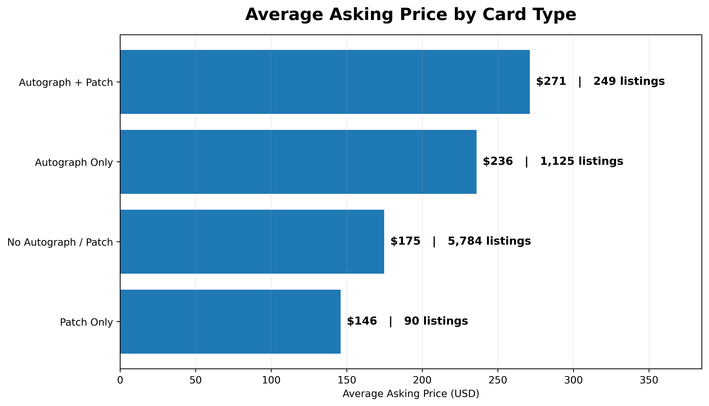
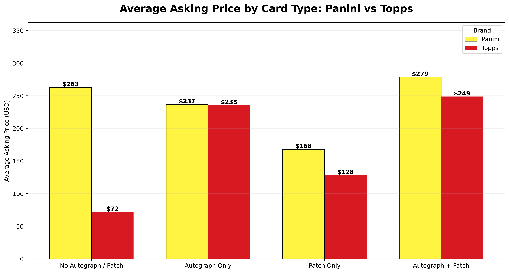
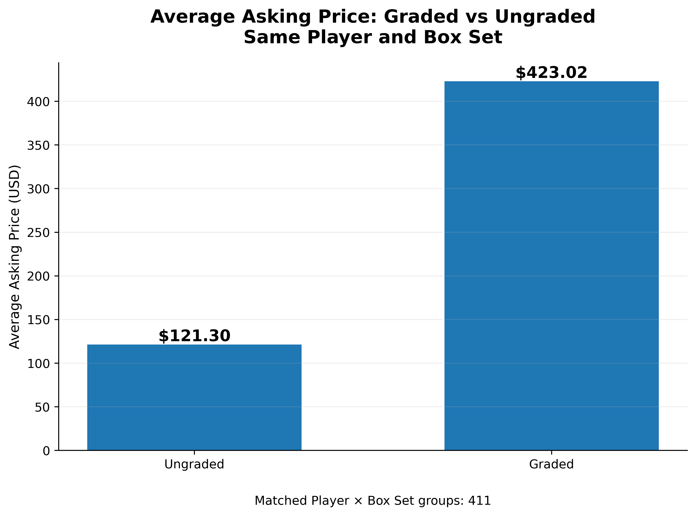
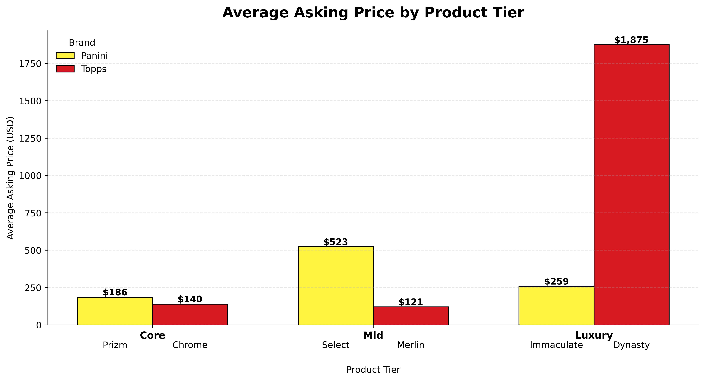

## What Affects Soccer Card Asking Prices?

After understanding the overall eBay market, the next step is to explore **why some cards are priced higher than others**.

A card's asking price can be influenced by many factors beyond the player alone. This section looks at several important card characteristics:

- **Autograph & Patch** — Do special card features lead to higher asking prices?
- **Brand** — Do Panini and Topps price similar card types differently?
- **Grading** — Are professionally graded cards priced higher than ungraded cards?
- **Rookie Status** — Does being a rookie card increase the asking price?
- **Product Tier** — How do card prices differ across Core, Mid, and Luxury products?

The goal is to understand **which card characteristics are associated with higher asking prices** and which factors may not matter as much as newcomers might expect.

> **For Newcomers:** A card is not expensive because of only one feature. The best comparison is usually with cards that have a similar **player, product line, grading status, rarity, and card type**.

### Card Features Affect Asking Price

#### **Do special card features make cards more expensive?**

This analysis compares four card types:

- No Autograph / Patch
- Autograph Only
- Patch Only
- Autograph + Patch

  

  <b>Figure 5.</b> Average asking price by card type. The labels also show the number of observed listings in each group.

The graph shows that cards with both an **autograph and patch** have the highest average asking price at about **$271**, followed by **autograph-only cards at $236**.

Standard cards without an autograph or patch average about **$175**, while **patch-only cards average $146**.

However, average prices can be affected by a small number of very expensive listings. The median prices are much closer:

| Card Type | Listings | Average Price | Median Price |
|---|---:|---:|---:|
| No Autograph / Patch | 5,784 | $174.75 | $44.99 |
| Autograph Only | 1,125 | $235.87 | $48.00 |
| Patch Only | 90 | $145.88 | $44.00 |
| Autograph + Patch | 249 | $271.11 | $64.99 |

The statistical results support an important point.

The difference in **average prices** is not statistically significant using Welch's ANOVA (`p = 0.106`), partly because prices vary widely and include extreme values.

However, the overall **price distributions are significantly different** using the Kruskal–Wallis test (`p < 0.001`).

The strongest difference appears in **Autograph + Patch cards**, which are significantly different from the other card groups in the pairwise comparisons.

> [!IMPORTANT]
> **Key Finding:** Cards with both an **autograph and patch** show the strongest price premium in this dataset. However, **special features do not always mean a higher price**. For example, **Patch Only** cards have a median price of about **$44**, which is very close to standard cards without an autograph or patch.

#### **Does Brand Matter for the Same Card Type?**

After looking at autograph and patch features, the next question is:

> **For the same card type, do Panini and Topps have different asking prices?**

  

  <b>Figure 6.</b> Average asking prices for Panini and Topps across four card types: standard cards, autograph cards, patch cards, and autograph + patch cards.

The graph shows that the difference between **Panini and Topps depends on the card type**.

The largest gap appears in cards with **no autograph or patch**. Panini averages about **$263**, compared with only **$72 for Topps**. This is also the only category where the difference in average price is statistically significant (`p < 0.001`).

For cards with special features, the two brands are much closer:

- **Autograph Only:** Panini $237 vs. Topps $235
- **Patch Only:** Panini $168 vs. Topps $128
- **Autograph + Patch:** Panini $279 vs. Topps $249

The average-price differences in these three groups are **not statistically significant**.

This suggests that once a card includes features such as an **autograph or patch**, the feature itself may become more important to asking price than the brand alone.

Because card prices are highly skewed, these averages should still be read together with median prices and comparable listings.

> [!IMPORTANT]
> **Key Finding:** Brand does not affect every card type in the same way. The strongest Panini–Topps price gap appears among cards with **no autograph or patch**, while autograph and patch cards have much closer average prices. For newcomers, this means **do not assume one brand is always more expensive — compare the same card type across brands before buying**.

### Grading Affect Asking Price

Before comparing prices, it is useful to understand what **card grading** means.

Professional grading is when a card is sent to a third-party grading company to evaluate its **condition and authenticity**. The card is usually given a numerical grade and sealed in a protective holder.

For collectors, grading can make a card easier to compare because the condition has been reviewed by an independent company. Higher grades, especially for cards in strong condition, may also receive higher asking prices.

However, a graded card is not automatically more valuable. Price can still depend on the **player, card rarity, product line, grade score, grading company, and collector demand**.

To better understand the effect of grading, this analysis compares graded and ungraded cards only within the **same player and same box set**.

  

  <b>Figure 7.</b> Average asking price of graded and ungraded cards within 411 matched Player × Box Set groups.

The graph shows a clear difference between graded and ungraded cards.

- **Ungraded cards:** average asking price of **$121.30**
- **Graded cards:** average asking price of **$423.02**

On average, graded cards are priced about **249% higher** than ungraded cards within the same player and box set groups.

The difference is also statistically significant using a paired t-test:

**t = 4.54, p < 0.001**

This means the observed price difference is unlikely to be explained by random variation alone in this matched sample.

However, grading itself is not the only possible reason for the higher price. Graded cards may also differ in **card quality, rarity, grade score, or collector interest**.

> [!IMPORTANT]
> **Key Finding:** Graded cards have a much higher average asking price than ungraded cards in the matched sample. For newcomers, grading can be an important price factor, but always check the **grade, grading company, card rarity, and comparable listings** before assuming that every graded card is worth more.check the **grade, grading company, card rarity, and comparable listings** before assuming that every graded card is worth more.

### Rookie Status Affect Asking Price

A **rookie card** is a card connected to a player's early professional career or first major card releases. Rookie cards often receive special attention from collectors because they represent an early stage of a player's career.

However, a card labeled as a rookie is **not automatically more expensive**. Price can also depend on the player, product line, rarity, autograph, grading, and overall collector interest.

To make the comparison fairer, rookie and non-rookie cards were compared only within the **same player and same box set**.

  

  <b>Figure 8.</b> Average asking price of rookie and non-rookie cards within 154 matched Player × Box Set groups.

Interestingly, the graph shows that **non-rookie cards have a higher average asking price** in this sample:

- **Non-Rookie:** $262.19
- **Rookie:** $170.48

However, the difference is **not statistically significant**.

The paired t-test gives:

**t = -0.89, p = 0.374**

A Wilcoxon signed-rank test gives a similar result:

**p = 0.195**

Since both p-values are above **0.05**, there is not enough evidence to conclude that rookie and non-rookie cards have different asking prices after matching the same player and box set.

> [!IMPORTANT]
> **Key Finding:** A **rookie label does not automatically mean a higher asking price**. In this matched sample, rookie cards are actually priced lower on average, but the difference is not statistically significant. For newcomers, rookie status should be considered together with **rarity, product line, autograph, grading, and comparable listings** rather than used as a price signal by itself.

### How Product Tier Relates to Card Asking Price

Before comparing individual card prices, it is useful to understand the **price of the box they come from**.

A higher-priced box usually represents a more premium product, but this does **not** mean every card inside the box will be expensive.

The box price is the **cost of entering the product**, while the card asking price shows how individual cards from that product are priced on eBay.

| Tier | Panini | Approx. Box Price | Topps | Approx. Box Price |
|---|---|---:|---|---:|
| **Core** | Prizm | ~$270 | Chrome | ~$228 |
| **Mid** | Select | ~$300–320 | Merlin | ~$261 |
| **Luxury** | Immaculate | Higher-end | Dynasty | ~$1,782 |

> **Important:** Box prices and individual card asking prices should not be compared as a direct return on investment. A box contains multiple cards, while eBay listings often represent selected cards with different players, rarity, grading, autographs, and serial numbers.

---

### Average Asking Price by Product Tier

  

  <b>Figure 9.</b> Average asking price of individual cards from comparable Panini and Topps product tiers.

### Core: Prizm vs Chrome

At the Core tier, the box prices are relatively close:

- **Prizm:** about $270 per box
- **Chrome:** about $228 per box

The individual cards show a similar direction:

- **Prizm average:** $186
- **Chrome average:** $140

Prizm cards have a higher average asking price, but the difference in the means is **not statistically significant** (`p = 0.413`).

The median prices are:

- **Prizm:** $56.03
- **Chrome:** $29.58

This suggests that a typical Prizm listing is also priced higher, even though large price variation makes the difference in average prices statistically unclear.

---

### Mid: Select vs Merlin

The box prices are again relatively close:

- **Select:** about $300–320
- **Merlin:** about $261

However, the individual card market looks very different.

- **Select average:** $523
- **Merlin average:** $121

Select has an average asking price more than **4 times higher** than Merlin.

This is the strongest comparison in the analysis, and the difference in average prices is **statistically significant** (`p = 0.0005`).

However, the medians are much lower:

- **Select:** $90
- **Merlin:** $29.99

This shows that a small number of very expensive Select cards push the average much higher.

> The average tells us about the overall price level, while the median gives a better picture of a typical listing.

---

### Luxury: Immaculate vs Dynasty

The Luxury tier looks very different.

- **Immaculate average:** $259
- **Dynasty average:** $1,875

Dynasty appears dramatically more expensive, which is also consistent with its much higher box price.

However, there are only **2 Dynasty listings** in the dataset, compared with **214 Immaculate listings**.

Because of this very small sample, the Dynasty average should **not be treated as representative of the full market**.

---

> [!IMPORTANT]
> **Key Finding:** A more expensive box does not automatically mean every card from that product will have a higher asking price. The relationship depends heavily on the cards that appear in the market. In this dataset, the clearest difference appears in the **Mid tier**, where Select has a much higher average asking price than Merlin. For newcomers, use **box price to understand the product tier**, then compare **median prices, average prices, and similar individual cards** before buying.
